# Random-Forest
**TELECOMMUNICATION-DIRECT MARKETING**

**Prepared by,**

**Aditi Kandoi,**

**Anish Dixit,**

**Aumkar Gadekar**

**The following document contains a detailed summary of the solution to
the problem statement 'Telecommunication- Direct Marketing' prepared by
team 'BADM\_074'.**

**Table of Contents**

> 1\. Introduction 
>
> 2\. Data Preparation 
>
> 3\. Exploratory Data Analysis
>
> 4\. Proposed Approach 
>
> 5\. Report 
>
> 6\. Conclusion 

**INTRODUCTION**
================

Direct marketing is a form of communicating an offer, where organizations communicate directly to a pre selected customer and supply a method for a direct response. Among practitioners, it is also known as direct response marketing. 
----------------------------------------------------------------------------------------------------------------------------------------------------------------------------------------------------------------------------------------

This marketing technique is particularly prevalent in the
telecommunication sector where direct calling is often among the most
relevant methods of converting customers.

The given business problem gives a dataset containing various parameters
of instances of this methodology which can be used to predict if an
existing customer will subscribe to a data pack or not.

The objective of this study is to implement a statistical model to give
the most accurate prediction validated on the hold out set.

The objective of this document is to explain the proposed solution, the
process of obtaining the solution and establishing how the proposed
model is the most befitting solution for the given business case.

**DATA PREPARATION**

It is a data mining technique that transforms raw data into an
understandable format. Raw data(real world data) is always incomplete
and that data cannot be sent through a model. That would cause certain
errors. That is why we need to preprocess data before sending through a
model.

1.  Import libraries

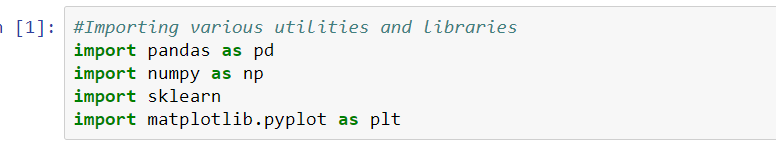

2.  Read data

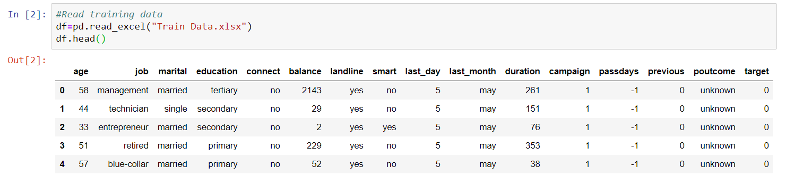

3.  Checking for Missing Data

We first check for null values, none of the entries were found to have
Nan values. However, some entries for education had unknown as the value
specified. To reduce ambiguous data, we drop the rows with education=
"unknown".

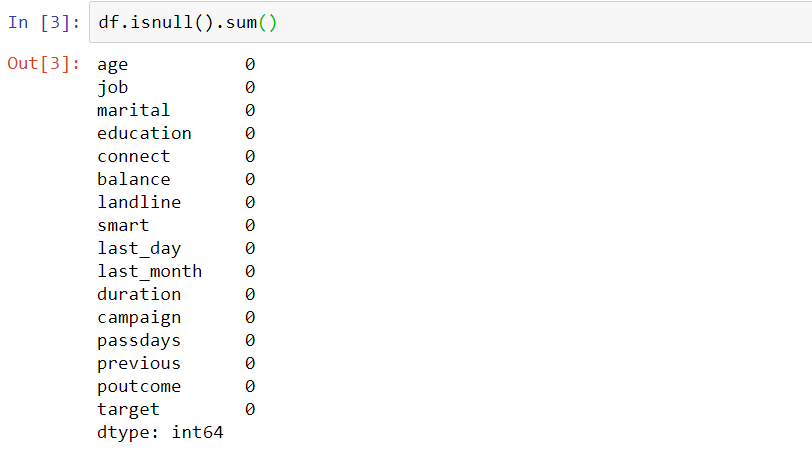

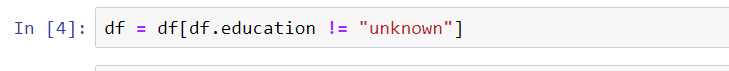

4.  Checking for Categorical Data

Since our model cannot accept categorical data or strings as input; we
have to convert it into numerical values. We use a label Encoder to give
a numerical value to the columns having string/category data.

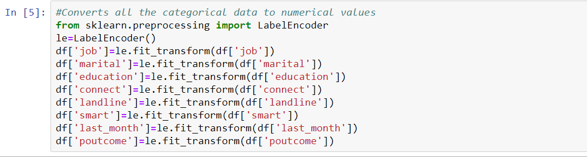

5.  Normalize the Data

We scale down the features, without distorting their range. We split the
data frame into input features X and dependent variable target(output)
ie. Y

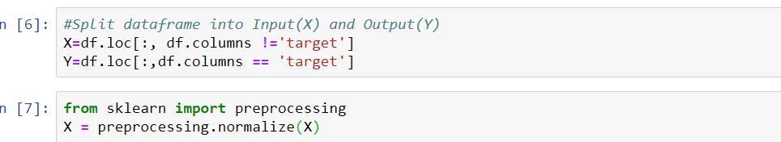

**EXPLORATORY DATA ANALYSIS**

Arguably the most underrated yet pivotal phase of formulating a
statistical model, EDA involves carefully scrutinizing the data,
familiarizing the data and then trying to derive insights about
overpowering features, irrelevant features, etc. from it before actually
moving on to modelling.

-   Graphing parameter last month against target shows us that the
    > customers with packs expiring in May are most likely to buy new
    > packs.

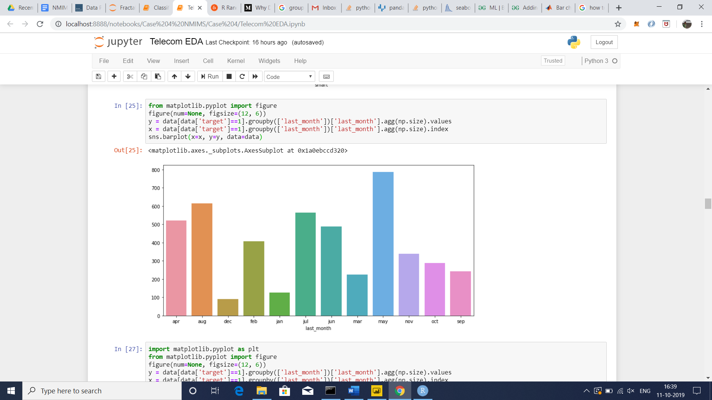

-   Graphing parameter job against target shows us that the customers
    > with management jobs are most likely to buy new packs.

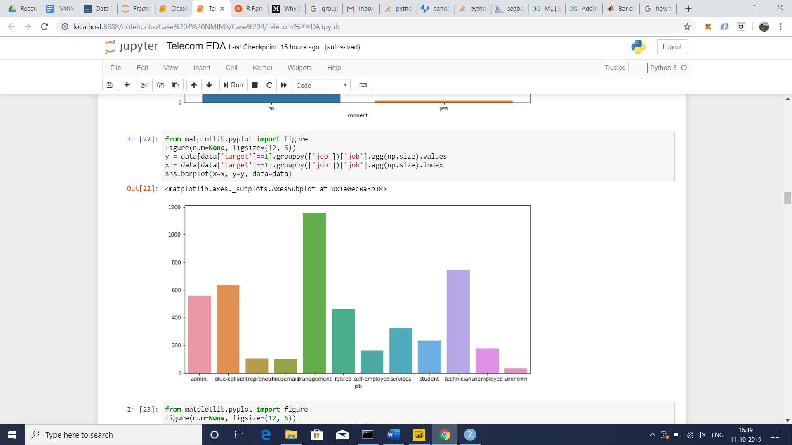

-   Graphing parameter education against target shows us that the
    > customers with secondary education are most likely to buy new
    > packs.

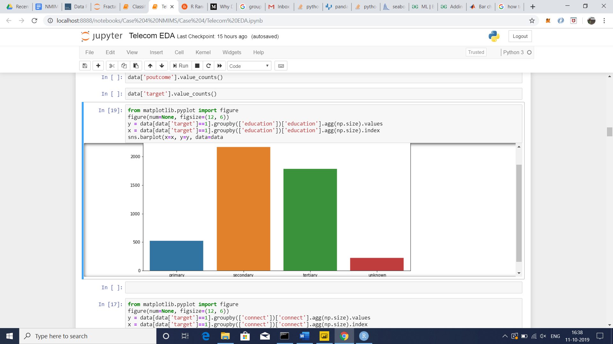

-   Graphing parameter marital status against target shows us that the
    > customers with management jobs are most likely to buy new packs.

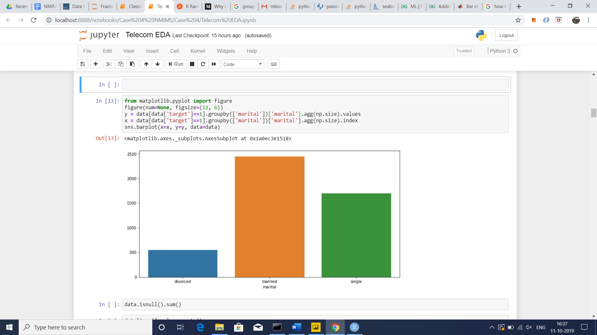

-   Graphing parameter duration against target shows us that the
    > customers whose calls lasted for 0-500 seconds are most likely to
    > buy new packs.

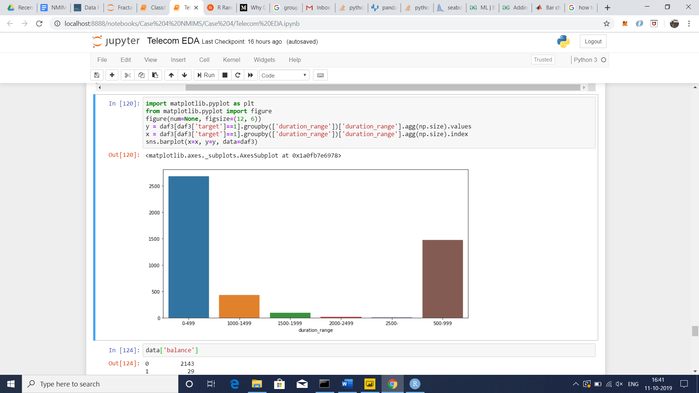

-   Graphing parameter smart against target shows us that the customers
    > who did not have smartphones are most likely to buy new packs.

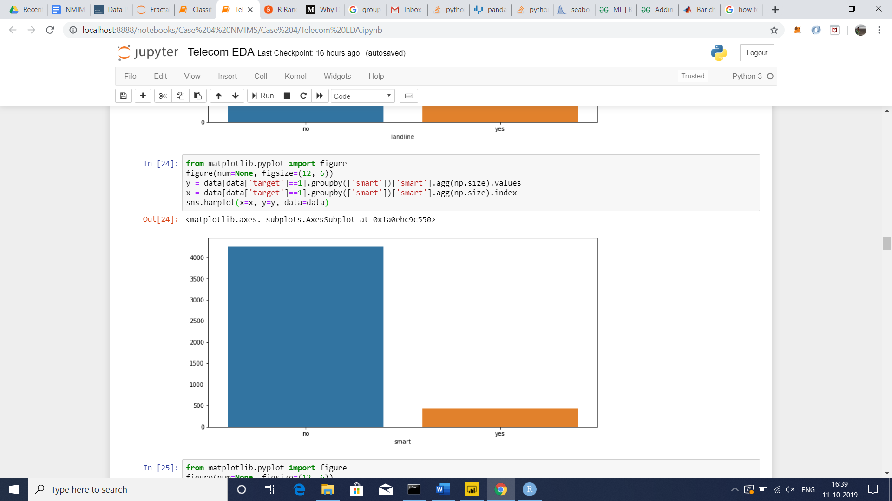

**[Final step in EDA: Feature Extraction]**

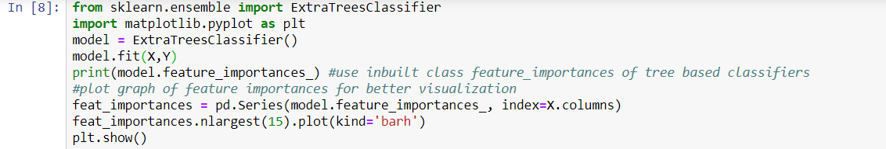

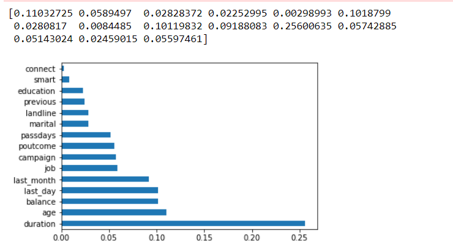

We tried various feature extraction techniques to find the dependence of
the output on the features and remove redundant attributes. The extra
trees classifier is a reliable feature selector and based on its
results, the attribute "connect" was found to have negligible impact on
the output. Hence this redundant feature was removed. Our validation set
too gave higher accuracy with this feature removed.

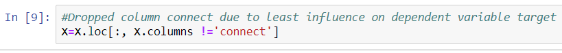

**PROPOSED APPROACH**

Once the data preprocessing and exploration is done, we have to actually
build a Machine Learning model for prediction and analysis.

In the given dataset, as the output variable(target) is a binary
variable(yes/no), the given problem falls under the category of Binary
Classification.

The algorithm we have chosen for this is a **Random Forest
classifier**.

Random forest algorithm is a supervised classification algorithm. As the
name suggests, this algorithm creates the forest with a number of trees.

In general, more trees in the forest, more robust the forest looks like.
In the same way in the random forest classifier, the higher the number
of trees in the forest, the higher the accuracy results.

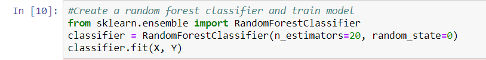

Now that the classifier has been trained, we use the validation data to
test its performance and compare with other algorithms.

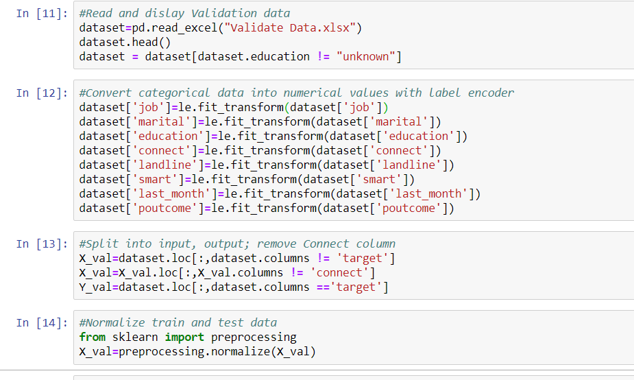

The validation data has been loaded and processed. We now predict output
for the validation data.

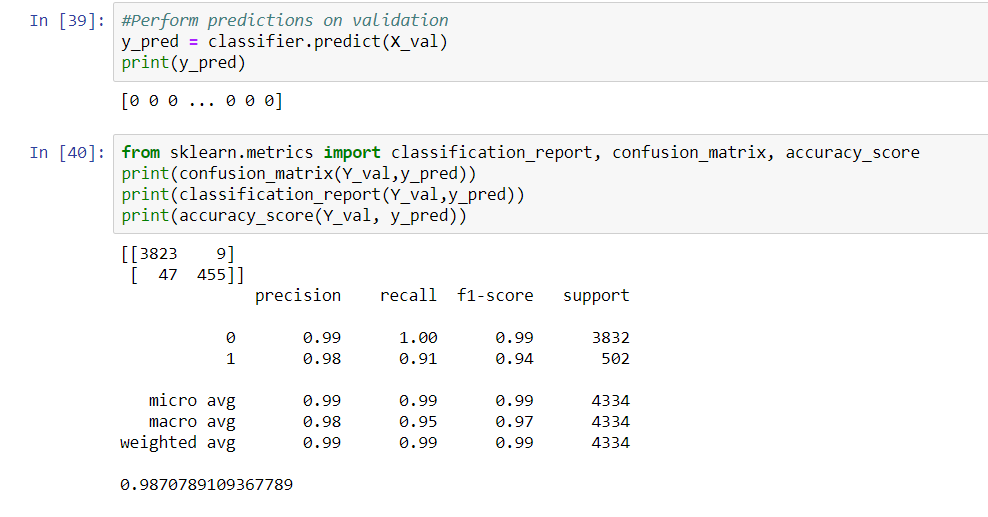

As it is observed that the given dataset is imbalanced, in the training
set only 4000 positive examples are observed as opposed to 35000
negative examples. Therefore, overall accuracy isn't the best indicator
of the model's performance. Hence, we use F1 score that takes into
consideration the precision and recall values, to evaluate the
performance of the classifier. An overall accuracy of 98.7% is observed.
An F1 score of 0.99/1 and 0.94/1 is observed for negative and positive
examples, respectively. This indicates high accuracy and performance.

**REPORT**

As we have seen in the previous step, the algorithm proposed in this
solution, i.e. a Random Forest Classifier gives an **accuracy of
98.7%**, and an **F1 score of 0.99** which matches almost perfectly 
with the real world observations. However, to further
validate our approach, we have implemented the same algorithm using R
language and libraries.

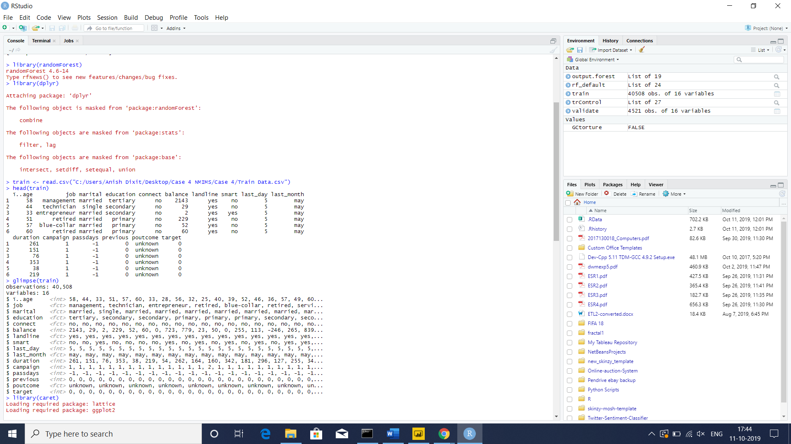

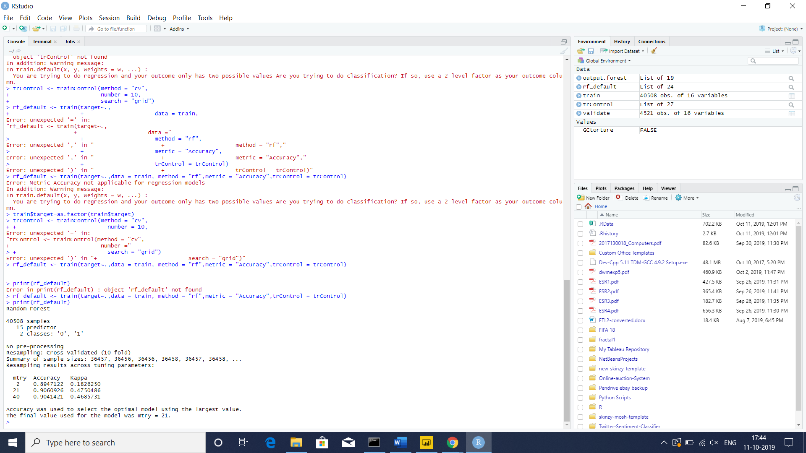

We obtain an accuracy of around 90% using this, which successfully cross
validates our technique.

To further strengthen our proposed methodology, we crossed the Random
Forest Algorithm with another popular classification algorithm, the
Naive Bayes classifier, and ran a ROC AUC curve (Receiver Operating
Characteristic, Area Under the Curve) and the results are as follows:

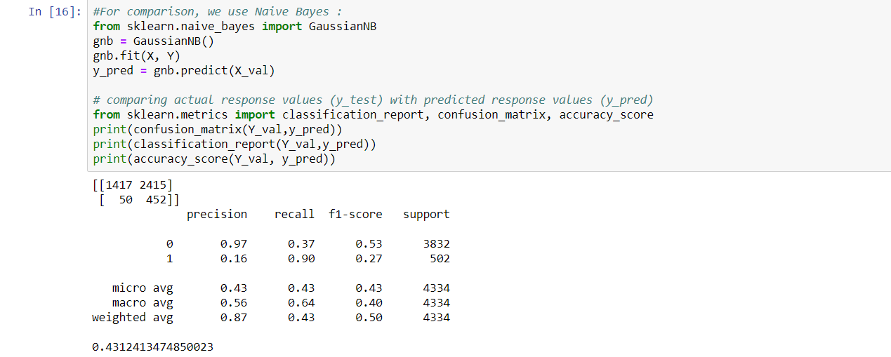

ROC plots :

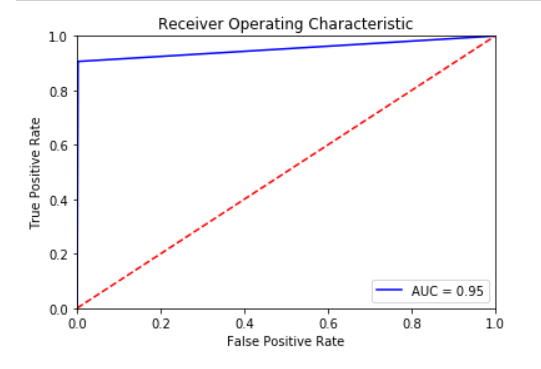
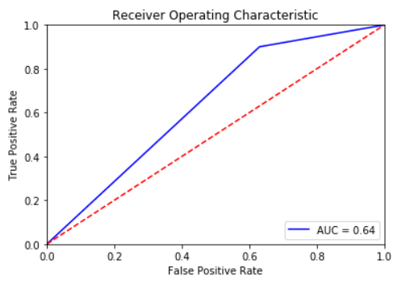

Random Forest Naive Bayes

This also proves that the algorithm that has been used is better than
other classification algorithms for this problem.

**CONCLUSION**

The given business problem about Digital Marketing in Telecommunication
was a classical statistical modelling problem. The solution proposed in
this document, while of a high degree of accuracy, is not without its
flaws, however, from a practicality purpose, it is a viable, and
therefore a sustainable solution.
